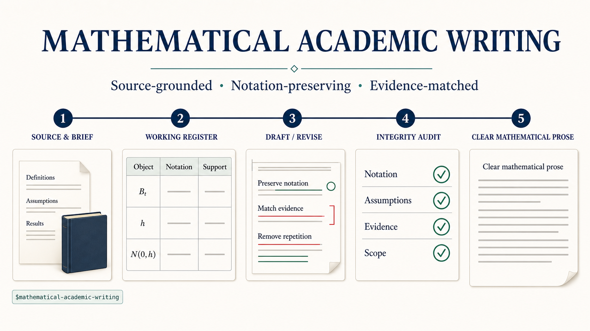

# Mathematical Academic Writing

[](#validation)
[](LICENSE)
[](https://github.com/JiahaoLi-creator/mathematical-academic-writing/actions/workflows/verify-core.yml)



A source-grounded Codex skill for precise, direct mathematical prose.

It helps Codex draft, revise, review, and verify writing in probability, stochastic processes,
stochastic calculus, quantitative finance, optimization, and numerical analysis. The skill protects
notation, assumptions, logical scope, citations, and evidence strength while reducing repetition
and generic defensive language.

## What it does

- Locks notation and technical terms to the governing source.
- Records claims, support, evidence level, location, and citation before drafting or revision.
- Matches verbs to evidence: proofs establish, derivations yield, figures display, and simulations
  estimate or agree numerically.
- Sites each claim where its support is strongest and replaces later repetition with references.
- Revises defensive prose by function while retaining mathematical negation, assumptions,
  counterexamples, and genuine limitations.
- Supports research articles, theorem-proof exposition, lecture explanations, computational
  studies, and visual companions.
- Separates stylistic revision from substantive mathematical verification.

In Revision mode, the workflow treats supplied mathematical content as locked and reports material
departures. Verification mode additionally needs the governing theorem, derivation, data, or
numerical evidence.

## Install in Codex

Clone the repository into the Codex skills directory:

```bash
mkdir -p ~/.codex/skills
git clone https://github.com/JiahaoLi-creator/mathematical-academic-writing.git \
  ~/.codex/skills/mathematical-academic-writing
```

Start a new Codex task so the installed skill is discovered. To update an existing installation:

```bash
git -C ~/.codex/skills/mathematical-academic-writing pull --ff-only
```

## Invoke the skill

Name it explicitly in the request:

```text
$mathematical-academic-writing

Task: Revision
Genre: Visual companion
Primary source: my lecture notes, Chapter 3
Audience: Students meeting Brownian path regularity for the first time

Preserve the notation and mathematical claims. Rewrite the figure interpretation
as one concise paragraph, explain the constant 0.674, and remove repeated generic
disclaimers.
```

Codex may also select the skill automatically when the requested deliverable is mathematical
prose. A useful request supplies:

- the task: Draft, Revision, Review, or Verification;
- the genre and intended reader;
- the primary and auxiliary sources;
- the notation, claims, or structure that must remain fixed;
- the desired length and output form.

See [quick-start examples](examples/quick-start.md) for reusable prompts.

## Modes

| Task mode | Use it for |
| --- | --- |
| Draft | Create original prose from supplied mathematical content and sources. |
| Revision | Improve existing prose while preserving its mathematical semantics. |
| Review | Recommend `Keep`, `Rewrite`, `Compress`, `Delete`, or `Flag`. |
| Verification | Check claims, assumptions, derivations, citations, or numerical conclusions against evidence. |

Genre profiles cover research articles, theorem-proof exposition, textbook and lecture
explanations, computational and empirical analysis, and visual companions.

## The working register

Before drafting or revision, the skill records the commitments that the output must preserve.

**Notation**

| Object | Authoritative notation | Allowed local abbreviation |
| --- | --- | --- |
| Standard Brownian motion | $B=(B_t)_{t\geq 0}$ | None |
| Positive time increment | $h>0$ | None |
| Standard normal variable | $Z\sim N(0,1)$ | None |
| Standard normal CDF | $\Phi$ | None |

**Claims**

| Claim | Support | Ladder rung | Site | Citation |
| --- | --- | --- | --- | --- |
| $(B_{t+h}-B_t)/h\overset{d}=Z/\sqrt h$ | Brownian increment law | Exact derivation | Figure interpretation | Supplied source, Chapter 3 |
| The median absolute quotient is $\Phi^{-1}(0.75)h^{-1/2}$ | Distributional calculation | Exact derivation | Figure interpretation | Supplied source, Chapter 3 |
| The plotted medians follow the reference scale across the displayed resolutions | Supplied Figure 6 | Figure | Figure interpretation | Supplied figure |
| The sample paths of standard Brownian motion are almost surely nowhere differentiable | Governing theorem | Formal theorem | Theorem reference | Supplied source, Chapter 3 |

An empty support entry is flagged rather than converted into a stronger claim.

## Example: direct mathematical prose

**Before**

> Figure 6 is not a proof that Brownian motion is nowhere differentiable. It should only be
> regarded as an illustration, and the plotted slopes should not be overinterpreted.

**After**

For an increment of length $h$,

$$
\frac{B_{t+h}-B_t}{h}\overset{d}=\frac{Z}{\sqrt h},
\qquad Z\sim N(0,1).
$$

Hence the median absolute difference quotient is
$\Phi^{-1}(0.75)h^{-1/2}\approx0.674h^{-1/2}$. In the supplied Figure 6, the plotted
medians follow this reference scale across the displayed resolutions. The cited theorem
establishes that the sample paths of standard Brownian motion are almost surely nowhere
differentiable.

The revision states the mathematical relation first, describes plotted evidence with visual
language, and attributes the formal conclusion to its theorem.

The anti-defensive audit does not remove negation mechanically. It retains negation when it defines
an object, states an assumption, separates a theorem from its converse, presents a counterexample,
or fixes an evidence boundary.

## Public repository boundary

This repository is the public runtime distribution. It contains the reusable skill and original
documentation, not the private research corpus or blind evaluation fixtures.

| Included | Not distributed |
| --- | --- |
| `SKILL.md` and Codex metadata | Source PDFs and textbook files |
| Mathematical-integrity and genre guidance | Extracted or normalized source text |
| Anti-defensive and visual-writing rules | Local notebooks and rendered fixtures |
| Public examples and workflow graphics | Signing keys and trust configuration |
| License, notices, provenance, and public CI | Internal evidence registry and approval records |
| Notice-only fixture stubs | Blind regression oracles and source-derived samples |

Citations identify intellectual sources; the cited publications themselves are not redistributed.
The public repository cannot independently reproduce the private corpus calibration.

## Validation

The accepted v0.2.0 snapshot was evaluated in fresh first-stage contexts and separate semantic
review contexts.

| Suite | First-stage result | Semantic result |
| --- | ---: | ---: |
| Synthetic review | 24/24 decisions | 51/51 assertions |
| MATH3015 notebook review | 9/9 decisions | 14/14 assertions |
| Evidence-grounded drafting | 3/3 cases | 13/13 assertions |

The same private release passed 58/58 main mutation cases and 45/45 corpus mutation cases. These
figures describe the accepted private validation lineage; the omitted corpus and blind oracles are
not reproducible from this public repository.

The eight byte-identical runtime files in this repository reproduce the accepted core binding:

```text
Core skill aggregate SHA-256
02a485d60cd7fd371f8a8b8219a96ad98ef04189936b108de9adea8c76f2e0d6

Private validation-harness lineage SHA-256
c24d7e652e51f05f086f3078d633b9cece8953c7a432430008cd99ffc2815609
```

Run the public check locally:

```bash
python3 -B scripts/verify_public_core.py
```

The check verifies the exact public file allowlist, regular-file and link constraints, the eight
core file hashes, their ordered aggregate, and a small credential/path scan. See
[`provenance/public-release.v1.json`](provenance/public-release.v1.json) for the public binding.

## Public package structure

```text
.
├── .github/workflows/verify-core.yml
├── SKILL.md
├── agents/openai.yaml
├── references/
├── project_profiles/math3015.md
├── examples/quick-start.md
├── assets/usage-workflow.png
├── provenance/public-release.v1.json
├── scripts/verify_public_core.py
├── tests/                         # notice-only public stubs
├── CHANGELOG.md
├── MAINTENANCE.md
├── LICENSE
├── THIRD_PARTY_NOTICES.md
└── README.md
```

## Attribution

The anti-defensive audit adapts the functional-classification, positive-scope,
precision-preservation, and review-first ideas of Kiterlin's MIT-licensed
[anti-defensive-writing](https://github.com/Kiterlin/anti-defensive-writing) skill.

This project independently applies those ideas to mathematical assumptions, formal negation,
notation fidelity, evidence levels, visual interpretation, stochastic claims, and validation.
See [`THIRD_PARTY_NOTICES.md`](THIRD_PARTY_NOTICES.md) for the upstream notice.

## License

Original code and documentation in this repository are available under the [MIT License](LICENSE).
Third-party publications and course materials cited by the project remain subject to their own
terms and are not included here.
